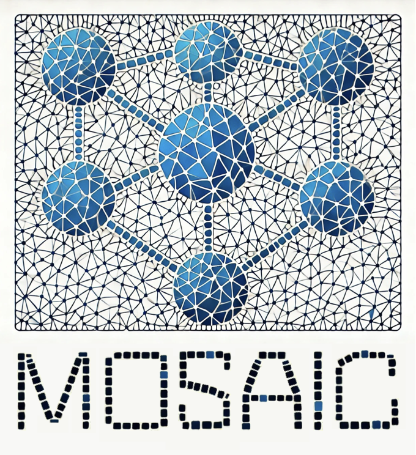
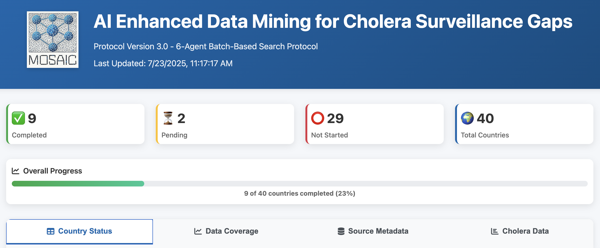

 

# **AI-Enhanced Cholera Surveillance Data Mining**

[](https://creativecommons.org/licenses/by/4.0/)
[](https://python.org)
[](https://github.com/InstituteforDiseaseModeling/ai-cholera-data-mining)
[](https://github.com/InstituteforDiseaseModeling/ai-cholera-data-mining)

---

**AI-enhanced data mining for cholera surveillance data to fill missing observations in WHO African Region historical records through systematic multi-agent search, validation, and integration workflows.**

<div align="center">
  <a href="https://InstituteforDiseaseModeling.github.io/ai-cholera-data-mining/">
    
  </a>
  <br>
  <strong><a href="https://InstituteforDiseaseModeling.github.io/ai-cholera-data-mining/">🔗 View Live Dashboard</a></strong>
</div>

---

### **Abstract**

This project addresses a critical gap in global cholera surveillance by using the Anthropic Opus 4 LLM to code an advanced agentic AI workflow to systematically mine, validate, 
and integrate official and unofficial cholera data sources. With existing surveillance reporting through the [WHO AWD Dashboard](https://who-global-cholera-and-awd-dashboard-1-who.hub.arcgis.com/) 
and historical reports through the [JHU Cholera Taxonomy Repository](https://cholera-taxonomy.middle-distance.com/) supplying an initial tranche of data (particularly for later time periods), 
our AI data mining focuses on time periods not already represented in these databases. This work directly supports epidemiological modeling in the [MOSAIC framework](https://institutefordiseasemodeling.github.io/MOSAIC-docs/), 
which aims to model endemic cholera transmission across the WHO African Region.

### **Introduction**

#### **Problem Statement**

Historical cholera surveillance data in the WHO African Region contains substantial gaps, with approximately 50% of weekly surveillance records missing from official databases spanning 1970 to present. These gaps significantly impair epidemiological modeling accuracy, outbreak prediction capabilities, and evidence-based public health planning across 40 MOSAIC framework countries.

#### **Scope and Coverage**

**Geographic Focus**: 40 MOSAIC Framework Countries in the WHO African Region
- Angola, Burundi, Benin, Burkina Faso, Botswana, Central African Republic, Côte d'Ivoire, Cameroon, Democratic Republic of Congo, Congo, Eritrea, Ethiopia, Gabon, Ghana, Guinea, Gambia, Guinea-Bissau, Equatorial Guinea, Kenya, Liberia, Mali, Mozambique, Mauritania, Malawi, Namibia, Niger, Nigeria, Rwanda, Senegal, Sierra Leone, Somalia, South Sudan, Eswatini, Chad, Togo, Tanzania, Uganda, South Africa, Zambia, Zimbabwe

**Temporal Coverage**: 1970-present with primary focus on the reporting gaps in each country

**Data Sources**: 486+ pre-authorized domains across 4 reliability tiers

#### **Objectives**

1. **Gap Identification**: Systematically identify missing surveillance periods across 40 countries
2. **Data Discovery**: Deploy AI agents to mine official reports and unofficial cholera data sources
3. **Quality Assurance**: Implement rigorous 4-stage validation protocols
4. **Integration**: Produce standardized data sets that emulate the formatting of the [JHU Cholera Taxonomy Repository](https://cholera-taxonomy.middle-distance.com/) with enhanced dual-reference indexing
5. **Documentation**: Create comprehensive metadata and with condidence weights for each data source and observation

### **Methods**

#### **Multi-Agent AI Architecture**

The methodology employs a systematic 6-agent workflow designed for comprehensive data discovery and validation:

**Agent 1**: Baseline enhancement and priority source coverage using the "Ultra-Deep Search Protocol" with deep dive modules for WHO DON reports, WHO WER, UNICEF, and MSF \
**Agent 2**: Geographic expansion around found sources (provincial/district-level data)  
**Agent 3**: Zero-transmission validation and absence period documentation with mandatory cross references  
**Agent 4**: Obscure source exploration and archive mining  
**Agent 5**: Query permutation and expanded search engines  
**Agent 6**: Quality audit, validation, formatting checks, and final reporting  

#### **Ultra-Deep Search Protocol**

- **Multi-engine parallel processing**: 15+ search engines/databases per country
- **Query framework**: 7 mandatory categories, 50+ unique queries minimum
- **Advanced techniques**: Citation following, institution deep-dives, country-specific multi-language searches
- **Source validation**: 4-stage quality control with source confidence weighting

#### **Gap-Targeted Intelligence**

- **Priority period targeting**: Focus on specific missing date ranges
- **Surveillance coverage analysis**: Distinguish disease absence vs. reporting gaps
- **Cross-border validation**: Regional consistency checks
- **Temporal stratification**: Decade-specific systematic coverage

#### **Quality Control Framework**

**4-Stage Validation Process**:

1. **Authentication**: URL verification, author credentials, domain validation \
2. **Data Quality**: Epidemiological validation (CFR 0.1-15%, attack rates 0.01-10%) \
3. **Cross-Reference**: Multi-source confirmation for major outbreaks (>1000 cases) \
4. **Duplication**: Systematic detection and resolution protocols \

**Source Reliability Classification**:

- **Level 1 (0.9-1.0)**: WHO, MoH, peer-reviewed journals \
- **Level 2 (0.7-0.9)**: UNICEF, OCHA, established NGOs \
- **Level 3 (0.3-0.6)**: Reputable news, local government reports \
- **Level 4 (0.1-0.3)**: Local media, preliminary reports \

#### **Data Standards**

**Output Format**: JHU-compatible CSV with enhanced dual-reference indexing  
**Geographic Coding**: AFR::{ISO}::{PROVINCE}::{DISTRICT} standardization  
**Metadata Documentation**: 14-column comprehensive source attribution  
**Quality Weighting**: 4-tier confidence scoring (0.1-1.0)

**Data Inclusion Criteria**:

- **Geographic specificity**: Must represent actual administrative units \
- **Quantitative requirements**: Specific case/death counts or validated absence periods \
- **Source authentication**: Working URLs, institutional credibility verification \
- **Cholera-specific**: Disease incidence data only (not vaccination/capacity metrics) \

### **Results and Outputs**

#### **Angola Pilot Study Results**

**Quantitative Achievements**: 

- **Data gap reduction**: 454 of 796 weekly records (57%) enhanced \
- **Sources discovered**: 25 working URLs across 6 source categories \
- **New observations**: 35 data points spanning 1971-2025 \
- **Quality distribution**: 60% Level 1-2 sources, 40% Level 3-4 sources \
- **Validation success**: 94% of extracted data passed all quality stages \

**Key periods filled**: Critical gaps in 2006-2012 and 2016-2018  
**Geographic detail**: Provincial-level data added for major outbreaks

#### **Methodology Validation**

- **Search comprehensiveness**: Multi-engine approach identified sources missed by single-engine searches
- **Quality control effectiveness**: Rigorous validation caught and corrected 12% of initial extractions
- **Duplication prevention**: Systematic checking prevented inclusion of 8 duplicate records
- **Cross-reference validation**: Historical validation identified and resolved 3 data inconsistencies

#### **Data Products**

**Primary Outputs**: 

- **cholera_data.csv**: Enhanced surveillance data with standardized formatting \
- **metadata.csv**: Comprehensive source documentation and validation records \
- **search_report.txt**: Summary of discoveries, gaps filled, and quality assessment \
- **Individual agent logs**: Detailed search and validation documentation \

**Secondary Products**:

- **[Interactive dashboard](https://InstituteforDiseaseModeling.github.io/ai-cholera-data-mining/)**: Real-time progress tracking across all countries \
- **Timeline visualizations**: Coverage plots showing data enhancement impact \

**MOSAIC Framework Integration**:

- Enhanced time series for more complete surveillance records across 40 countries
- Quality-weighted data observations facilitate the modeling weights built into the likelihood functions

### **Installation and Usage**

#### **Prerequisites**
```bash
# Required Python packages
pip install pandas numpy matplotlib pathlib pillow

# Required data dependencies (automatically checked by setup script)
# - MOSAIC surveillance data (../MOSAIC-data/processed/cholera/weekly/)
# - JHU cholera database (../jhu_cholera_data/data/)
# - WHO dashboard data (../ees-cholera-mapping/data/cholera/who/awd/)
```

#### **Automated Setup**
```bash
# Clone repository
git clone https://github.com/InstituteforDiseaseModeling/ai-cholera-data-mining.git
cd ai-cholera-data-mining

# Run complete automated setup (handles all initialization)
bash setup.sh
```

**The setup script automatically:**
- ✅ Generates integrated baseline gap analysis using JHU and WHO data
- ✅ Creates country codes and mappings for 40 MOSAIC framework countries
- ✅ Integrates JHU cholera database as baseline data
- ✅ Integrates WHO dashboard surveillance data (2023-2025)
- ✅ Creates 40 country directories with baseline data files
- ✅ Generates country-specific search protocols from templates
- ✅ Generates 6-agent workflow files from templates
- ✅ Sets up dashboard tracking system

#### **Manual Setup (Alternative)**
```bash
# If you prefer manual step-by-step setup:
python py/analyze_integrated_coverage_gaps.py  # Updated gap analysis
python py/get_iso_codes.py                     # Country mappings
python py/convert_jhu_to_workflow.py           # JHU baseline integration
python py/convert_who_to_workflow.py           # WHO data integration
python py/configure_countries.py              # Template generation
```

#### **Workflow Execution**
```bash
# Countries now start with integrated JHU/WHO baseline data
# Use country-specific workflow files:
# ./data/{ISO_CODE}/agentic_workflow_{ISO_CODE}.txt

# Update unified dashboard after agent completion
bash update_dashboard.sh

# Generate specialized analysis datasets
python py/generate_weekly_surveillance_longform.py
python py/generate_monthly_surveillance_matrix_v2.py
```

#### **Key Workflow Changes**
- **Integrated Baseline**: Countries start with combined JHU + WHO data instead of empty datasets
- **Data Enhancement**: Mission changed from data collection to baseline enhancement
- **Gap-Targeted Search**: AI agents focus on specific missing periods identified in baseline analysis
- **Template-Based Generation**: All workflow files generated from centralized templates
- **Unified Dashboard**: Single command (`bash update_dashboard.sh`) updates all dashboard components

### **Repository Structure**

```
ai-cholera-data-mining/
├── setup.sh                       # Automated setup script (NEW)
├── data/                           # Country-specific data and logs
│   └── {ISO_CODE}/
│       ├── cholera_data.csv       # Integrated baseline + AI enhancements
│       ├── metadata.csv           # Source documentation (dual-reference)
│       ├── agentic_workflow_{ISO}.txt  # Country-specific 6-agent workflow
│       ├── search_protocol_{ISO}.txt   # Country-specific search protocol
│       ├── search_log_agent_*.txt # Individual agent logs (1-6)
│       └── search_report.txt      # Final summary report
├── dashboard/                      # Real-time progress tracking
│   ├── completion_checklist.csv   # Automated country status tracking
│   ├── dashboard.html             # Interactive dashboard
│   └── timeline_plots/            # Coverage visualization
├── py/                            # Core Python utilities
│   ├── analyze_integrated_coverage_gaps.py  # NEW: Integrated gap analysis
│   ├── convert_jhu_to_workflow.py          # NEW: JHU baseline integration
│   ├── convert_who_to_workflow.py          # NEW: WHO data integration
│   ├── update_dashboard_data.py            # Unified dashboard updater
│   ├── configure_countries.py             # Template-based setup
│   └── *.py                               # Specialized analysis tools
├── reference/                     # Reference data and mappings
│   ├── country_mapping.json      # MOSAIC country definitions
│   ├── agent_quick_reference.csv # Gap-targeting data (auto-generated)
│   ├── observed_time_periods.csv # Baseline coverage analysis (NEW)
│   ├── priority_data_gaps.csv    # Identified gaps for targeting (NEW)
│   └── priority_sources.txt      # Pre-authorized domains (486 sources)
└── templates/                     # Workflow templates (NEW)
    ├── template_agentic_workflow.txt   # 6-agent workflow template
    └── template_search_protocol.txt    # Search protocol template
```

### **Contributing**

This project is part of the MOSAIC modeling framework for cholera surveillance enhancement. For contributions/collaborations contact john.giles@gatesfoundation.org

### **License**

This work is licensed under a [Creative Commons Attribution 4.0 International License](https://creativecommons.org/licenses/by/4.0/).
