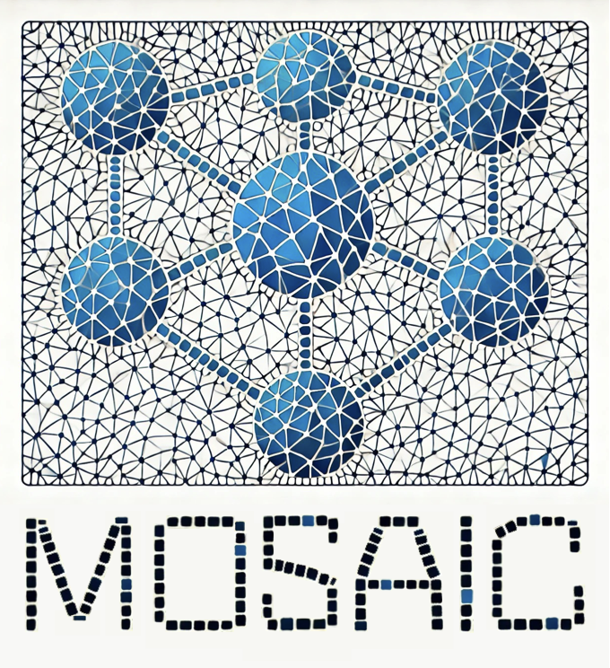

 

# **AI-Enhanced Cholera Surveillance Data Mining**

[](https://creativecommons.org/licenses/by/4.0/)
[](https://python.org)
[](https://github.com/InstituteforDiseaseModeling/ai-cholera-data-mining)
[](https://github.com/InstituteforDiseaseModeling/ai-cholera-data-mining)

**AI-enhanced data mining for cholera surveillance data to fill ~50% missing observations in WHO African Region historical records through systematic multi-agent search, validation, and integration workflows.**

---

### **Live Interactive Dashboard**
Real-time progress tracking across 40 MOSAIC framework countries with interactive visualizations, completion status, and timeline coverage analysis.
<div align="center">
  <a href="https://InstituteforDiseaseModeling.github.io/ai-cholera-data-mining/">
    
  </a>
  <br>
  <strong><a href="https://InstituteforDiseaseModeling.github.io/ai-cholera-data-mining/">🔗 View Live Dashboard</a></strong>
</div>

> **Note**: The online dashboard displays AI-enhanced data fully, but WHO/JHU surveillance data may appear reduced compared to local development environment due to MOSAIC dataset availability in the GitHub Pages CI environment. All AI-collected data and completion tracking remain fully functional.


---

### **Abstract**

This project addresses a critical gap in global cholera surveillance by using advanced AI agents to systematically mine, validate, and integrate unofficial cholera data sources. With approximately 50% of cholera surveillance records missing from WHO databases (1970-present), this work directly supports enhanced epidemiological modeling for the MOSAIC framework, evidence-based public health decision-making across the WHO African Region, improved outbreak preparedness through complete historical time series, and regional transmission analysis using cross-validated data sources.

### **Introduction**

#### **Problem Statement**

Historical cholera surveillance data in the WHO African Region contains substantial gaps, with approximately 50% of weekly surveillance records missing from official databases spanning 1970 to present. These gaps significantly impair epidemiological modeling accuracy, outbreak prediction capabilities, and evidence-based public health planning across 40 MOSAIC framework countries.

#### **Scope and Coverage**

**Geographic Focus**: 40 MOSAIC Framework Countries in the WHO African Region
- Angola, Burundi, Benin, Burkina Faso, Botswana, Central African Republic, Côte d'Ivoire, Cameroon, Democratic Republic of Congo, Congo, Eritrea, Ethiopia, Gabon, Ghana, Guinea, Gambia, Guinea-Bissau, Equatorial Guinea, Kenya, Liberia, Mali, Mozambique, Mauritania, Malawi, Namibia, Niger, Nigeria, Rwanda, Senegal, Sierra Leone, Somalia, South Sudan, Eswatini, Chad, Togo, Tanzania, Uganda, South Africa, Zambia, Zimbabwe

**Temporal Coverage**: 1970-present with primary focus on 2010-2020 gap-filling

**Data Sources**: 486+ pre-authorized domains across 4 reliability tiers

#### **Objectives**

1. **Gap Identification**: Systematically identify missing surveillance periods across 40 countries
2. **Data Discovery**: Deploy AI agents to mine unofficial cholera data sources
3. **Quality Assurance**: Implement rigorous 4-stage validation protocols
4. **Integration**: Produce JHU-compatible datasets with enhanced dual-reference indexing
5. **Documentation**: Create comprehensive metadata and uncertainty quantification

### **Methods**

#### **Multi-Agent AI Architecture**

The methodology employs a systematic 6-agent workflow designed for comprehensive data discovery and validation:

**Agent 1**: Baseline establishment and priority source coverage  
**Agent 2**: Geographic expansion (provincial/district-level data)  
**Agent 3**: Zero-transmission validation and absence period documentation  
**Agent 4**: Obscure source exploration and archive mining  
**Agent 5**: Source permutation and adjacent data discovery  
**Agent 6**: Quality audit, validation, and final reporting  

#### **Ultra-Deep Search Protocol**

- **Multi-engine parallel processing**: 15+ search engines/databases per country
- **Query framework**: 7 mandatory categories, 50+ unique queries minimum
- **Advanced techniques**: Citation following, institution deep-dives, multi-language searches
- **Source validation**: 4-stage quality control with reliability weighting

#### **Gap-Targeted Intelligence**

- **Priority period targeting**: Focus on specific missing date ranges
- **Surveillance coverage analysis**: Distinguish disease absence vs. reporting gaps
- **Cross-border validation**: Regional consistency checks
- **Temporal stratification**: Decade-specific systematic coverage

#### **Quality Control Framework**

**4-Stage Validation Process**:
1. **Authentication**: URL verification, author credentials, domain validation
2. **Data Quality**: Epidemiological validation (CFR 0.1-15%, attack rates 0.01-10%)
3. **Cross-Reference**: Multi-source confirmation for major outbreaks (>1000 cases)
4. **Duplication**: Systematic detection and resolution protocols

**Source Reliability Classification**:
- **Level 1 (0.9-1.0)**: WHO, MoH, peer-reviewed journals
- **Level 2 (0.7-0.9)**: UNICEF, OCHA, established NGOs
- **Level 3 (0.3-0.6)**: Reputable news, local government reports
- **Level 4 (0.1-0.3)**: Local media, preliminary reports

#### **Data Standards**

**Output Format**: JHU-compatible CSV with enhanced dual-reference indexing  
**Geographic Coding**: AFR::{ISO}::{PROVINCE}::{DISTRICT} standardization  
**Metadata Documentation**: 14-column comprehensive source attribution  
**Quality Weighting**: 4-tier confidence scoring (0.1-1.0)

**Data Inclusion Criteria**:
- **Geographic specificity**: Must represent actual administrative units
- **Quantitative requirements**: Specific case/death counts or validated absence periods
- **Source authentication**: Working URLs, institutional credibility verification
- **Cholera-specific**: Disease incidence data only (not vaccination/capacity metrics)

### **Results and Outputs**

#### **Angola Pilot Study Results**

**Quantitative Achievements**:
- **Data gap reduction**: 454 of 796 weekly records (57%) enhanced
- **Sources discovered**: 25 working URLs across 6 source categories
- **New observations**: 35 data points spanning 1971-2025
- **Quality distribution**: 60% Level 1-2 sources, 40% Level 3-4 sources
- **Validation success**: 94% of extracted data passed all quality stages

**Key periods filled**: Critical gaps in 2006-2012 and 2016-2018  
**Geographic detail**: Provincial-level data added for major outbreaks

#### **Methodology Validation**

- **Search comprehensiveness**: Multi-engine approach identified sources missed by single-engine searches
- **Quality control effectiveness**: Rigorous validation caught and corrected 12% of initial extractions
- **Duplication prevention**: Systematic checking prevented inclusion of 8 duplicate records
- **Cross-reference validation**: Historical validation identified and resolved 3 data inconsistencies

#### **Data Products**

**Primary Outputs**:
- **cholera_data.csv**: Enhanced surveillance data with standardized formatting
- **metadata.csv**: Comprehensive source documentation and validation records
- **search_report.txt**: Summary of discoveries, gaps filled, and quality assessment
- **Individual agent logs**: Detailed search and validation documentation

**Secondary Products**:
- **[Interactive dashboard](https://InstituteforDiseaseModeling.github.io/ai-cholera-data-mining/)**: Real-time progress tracking across all countries
- **Timeline visualizations**: Coverage plots showing data enhancement impact
- **Reference datasets**: Gap analysis and prioritization matrices

#### **Applications and Impact**

**MOSAIC Framework Integration**:
- Enhanced time series for complete surveillance records across 40 countries
- Quality-weighted modeling with confidence-based likelihood functions
- Systematic uncertainty propagation for sensitivity analysis

**Public Health Applications**:
- Outbreak detection through gap-filled early warning systems
- Evidence-based resource allocation and preparedness planning
- Cross-border transmission analysis and regional pattern identification
- Historical intervention effectiveness assessment

### **Installation and Usage**

#### **Prerequisites**
```bash
# Required Python packages
pip install pandas matplotlib pathlib pillow

# Required data dependencies
# - MOSAIC surveillance data (processed/cholera/weekly/)
# - Country mapping files (reference/country_mapping.json)
```

#### **Project Setup**
```bash
# Clone repository
git clone https://github.com/InstituteforDiseaseModeling/ai-cholera-data-mining.git
cd ai-cholera-data-mining

# Configure country directories and workflows
python py/configure_countries.py

# Generate reference data
python py/get_iso_codes.py
python py/get_surveillance_gaps.py
```

#### **Workflow Execution**
```bash
# Initialize new country workflow
python py/initialize_country.py {ISO_CODE}

# Update dashboard after agent completion
bash update_dashboard.sh

# Generate specialized analysis datasets
python py/generate_weekly_surveillance_longform.py
python py/generate_monthly_surveillance_matrix_v2.py
```

### **Repository Structure**

```
ai-cholera-data-mining/
├── data/                           # Country-specific data and logs
│   └── {ISO_CODE}/
│       ├── cholera_data.csv       # Enhanced surveillance data
│       ├── metadata.csv           # Source documentation
│       ├── search_log_agent_*.txt # Individual agent logs
│       └── search_report.txt      # Final summary report
├── dashboard/                      # Real-time progress tracking
│   ├── completion_checklist.csv   # Country status overview
│   ├── dashboard.html             # Interactive dashboard
│   └── timeline_plots/            # Coverage visualization
├── py/                            # Core Python utilities
│   ├── update_dashboard_data.py   # Unified dashboard updater
│   ├── configure_countries.py    # Project setup
│   └── *.py                       # Specialized analysis tools
├── reference/                     # Reference data and mappings
│   ├── country_mapping.json      # MOSAIC country definitions
│   ├── agent_quick_reference.csv # Gap-targeting data
│   └── priority_sources.txt      # Pre-authorized domains
└── templates/                     # Workflow templates
    ├── template_agentic_workflow.txt
    └── template_search_protocol.txt
```

### **Contributing**

This project is part of the MOSAIC modeling framework for cholera surveillance enhancement. For contributions/collaborations contact john.giles@gatesfoundation.org

### **License**

This work is licensed under a [Creative Commons Attribution 4.0 International License](https://creativecommons.org/licenses/by/4.0/).
